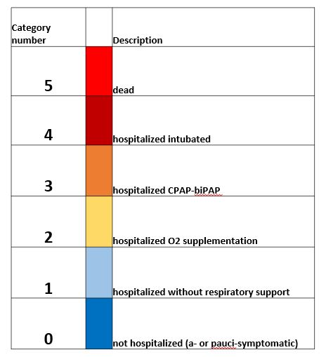
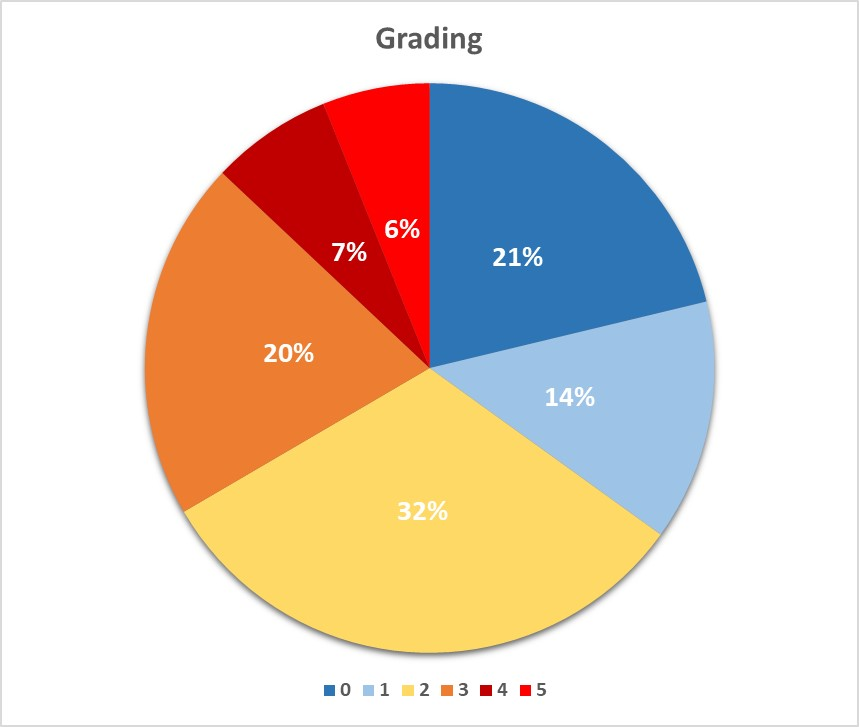

# An Explainable Model of Host Genetic Interactions Linked to Covid-19 Severity
## Introduction
This project focus on the mapping of host-genetics factors determining COVID-19 severity using Machine learning approaches (supervised, unsupervised Machine learning methods, Pathway signaling processes, and Open Targets web-based Platform) at the bioinformatics group of the Biology Lab, Scuola Normale Superiore di-Pisa, Italy.

This project is strongly motivated by the scholarly works done so far using Geno-Wide Association studies (GWS) in identifying chromosome loci and genetic variants related to COVID-19 susceptibility severity among patients. However, an organic model explaining how these genetic factors concur in the establishment of susceptibility to severe infection when exposed to the SARS-CoV-2 coronavirus infection was not covered using the GWS approaches. Also, there is currently limited usage of Machine learning (ML) techniques available to experts working with Whole-exome sequencing (WES) data sets related to COVID-19. Our study utilized the whole-exome sequencing genome dataset of 2000 European descent patients collected from the GEN-COVID Multicenter Study group (https://clinicaltrials.gov/ct2/show/NCT04549831) coordinated by the University of Siena. The whole-exome genome sequencing dataset contained 1.057M genetic variants of the patients. We used the 2000 patients’ original phenotype information to filter only patients with severity and asymptomatic across all classification criteria (841 patients).

  
   
  

  
   
  

### Project Tasks were organized as follows:

1. Performed stratified k-fold to split phenotype dataset into training and testing: here we generated using a python script, the stratified 5-fold split of the patients' phenotype information into 80 % training sets and 20 % testing sets. 

2. screening variants on the training set from each fold: we used the training set phenotype information generated from the stratified 5-folds CV approach to screen the Whole Exome Sequencing (WES) ~ 1.057M variants of the patients in each split (i.e., training fold 1 - 5). The Log-Odds-Ratio statistics |LOR| < 1 with cut-off of 6 and p_value <= 0.05 were used to filtered variants we considered as significantly relevants (enriched or asymptomatic). We generated a contingency table to measure the enrichment of reference (Ref) or alternative (Alt) alleles in either severe or control groups by employing an additive model, whereby homozygous genotype (1/1) has twice the risk (or protection) of the heterozygous type (0/1 or 1/0). Alleles flagged as somatic were considered as Ref alleles. 

3. Feature count matrices extractions: we used a python script for this task, we repeated the re-run five times, at each run we considered a single stratified K-fold split fitered 80 % training set variants. The filtered variants for the training set in each fold was remapped back to extract the allele freqency count in each of the 24 chromosome (Chr1 - ChrY) zipped CSV files. This helped us to develop the feature count matrices for each of the training set in the 5-fold. The 20 % test sets in each fold were left unscreened, we however, remapped the identified variants from the training set of each fold to formulate the feature count matrices. 

4. Feature selection: This jupyter notebook script was used to further reduce the number of considered features initially screened through the Log-Odds-Ratio statistics from the 5-folds. Variants with allele counts correlation coefficients corr.≤|0.8| were removed from the feature count matrices.  

5. Training the model using the stratified k-fold and 5-fold GridSearchCV: In this task we used the Jupyter notebook interactive platform python script to train the stratified 5-fold feature count matrices. We used the Support Vector Classifier (SVC), Logistic Regression classifier, Random Forest classifier and XGBoost classifier with GirdSearchCV. The best GridSearchCV model parameters were used to fit the 80 % training set in each of the 5-folds. We further made predictions using the 20 % testing set in each of the stratfied 5-folds. We further output the prediction probabilities and the model feature importance coefficients for each of the four ML classifiers in each of the stratified 5-folds CV.

6. Results aggregation from each ML model: In this task we utilized the Jupyter notebook script to further visualized the ROC-AUC plot from the combined prediction probabilities (Median method) for each of the four ML classifiers (SVC, Logistic Regression, Random Forest and XGBoost) in the stratfied 5-folds CV. 

7. Perform the variant interpretation using PCA, UMAP, K-Means clustering and Pathway analysis: In this task we utilized the Jupyter notebook script to further study the non-zero variants output from training the decision tree like ML classifiers (i.e., Random Forest and XGBoost).  The variants were remapped back into the feature space to form a new feature count matrix covering 100 % of the samples (i.e. 841 individuals). This reduced feature matrix was analyzed using Principal Component Analysis (PCA) techniques to reduce the dimensional space.

8. Remapping procedure if needed (whenever the training has been done on a different genome assembly): This task is optional should incase the training was done with different genome assembly e.g. "hg_37" to "hg_38". 

9. 16 full supported variants analyses: 16 variants consistently received non-zero coefficients in all decision tree-based models (Random Forest and XGBoost). We recycled the Jupyter notebook script from 3 to further re-evaluate the predictive power of these variants with and without covariates (age and sex). We extracted these 16 full supported variants from each of the stratified 5-fold training and testing feature count matrices and performed the supervised Machine Learning process. 

10. Final testing on external dataset from new cohort (3rd, 4th wave, etc..): this python script was further used to merge our new arrival WES (3000 cohort) vcf zipped files from our collaborators to extract relevant identified variants from the 2000 cohorts for further validation of our models.  

**Authors**: Anthony Onoja, Nicola Picchiotti,GEN-COVID Multicenter Study, Francesca Colombo, Francesca Chiaromonte, Alessandra Renieri, Simone Furini, Francesco Raimondi.

***Software and Packages:*** All the analyses were performed using a customized Python script,Jupyter notebook, with the following libraries: scipy 1.2.0, numpy 1.19.4, scikit-learn 0.23.2., statsmodels 0.11.0 and matplotlib 3.2.1

**Note**: The WES dataset (variant stat., and feature count matrices) that support the findings of this study are available from GEN-COVID Multicenter Study group (https://clinicaltrials.gov/ct2/show/NCT04549831) and Francesco Raimondi (Ph.D.) head of Bioinformatics group at Bio@SNS lab but restrictions apply to the availability of these data, which were used under license for the current study, and so are not publicly made available. Data are however available from the authors upon reasonable request and with permission of GEN-COVID Multicenter Study group.

**Date**: 10/11/2021
